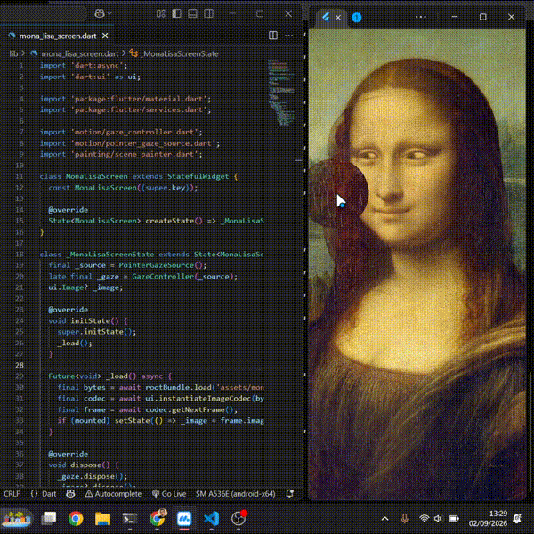
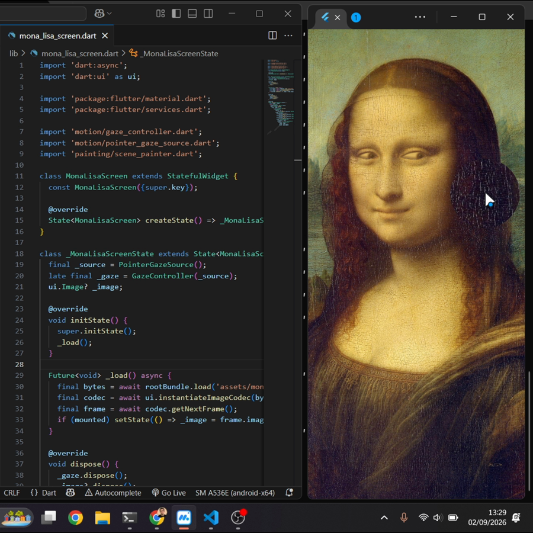

# lisa

Mona Lisa that looks at your cursor.



Small Flutter toy. The eyes are cut out of the painting and drawn back in
with `CustomPainter`, so the iris can follow the pointer. There's a
magnifier that follows the pointer too, mostly so you can look at the
craquelure. I hid a signature in the bottom right, you'll need the
magnifier to read it.

## Running

```
flutter pub get
flutter run -d windows   # or any device
```

Mouse hover works on desktop. On Android you have to touch the screen,
there's no hover.

## How it works

- `assets/mona.jpg` has the eyes painted white.
- `EyesPainter` fills the holes with the base ochre, then a blurred iris
  and pupil, clipped to the hole outline. The outlines are polygons traced
  from the white pixels (see the script comment in the file if you swap
  the image).
- `GazeController` smooths the pointer position with a ticker so the eyes
  ease into place instead of snapping.
- `GazeSource` is the input. `PointerGazeSource` is the mouse/touch one,
  `TiltGazeSource` (accelerometer) exists but isn't wired up right now.
- `ScenePainter` draws the portrait, the eyes, then the same thing again
  scaled 2.2x inside a circle clip for the lens.

Both irises share one direction so she doesn't go cross-eyed when the
pointer is on her face.

## Dev

`test/render_test.dart` dumps a frame to a png, handy for tweaking the eye
colors without a device:

```
flutter test test/render_test.dart --dart-define=OUT=out.png --dart-define=GAZEX=-0.5
```

The test runner has no fonts so the signature shows as boxes there.


